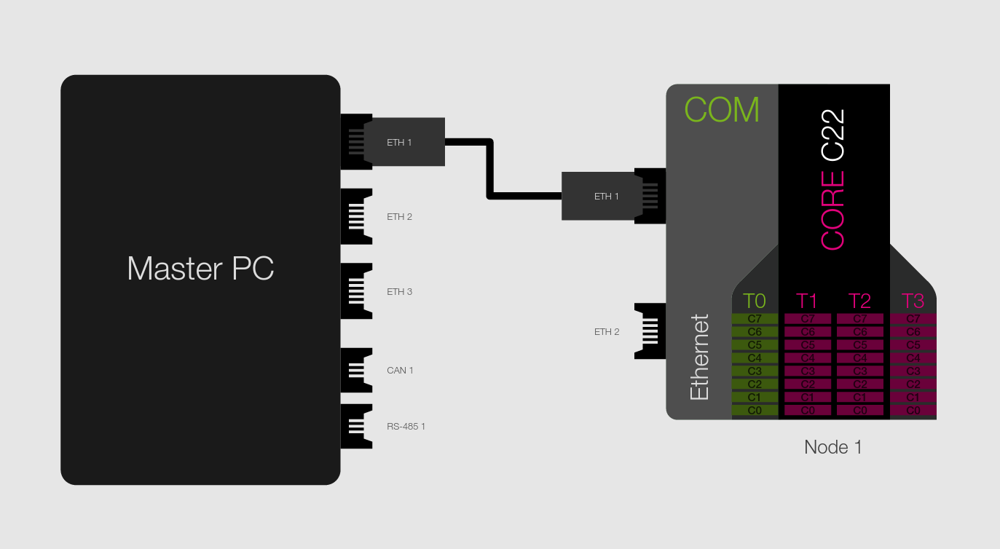

Firmware Update demo
=====================================

The purpose of this app is showing the use of the module_ethernet_fw_update in your applications.

Overview
----------
We will run the application on a SOMANET node connected to our Ethernet Local Area Network. On a Linux PC we will run the master firmware update application. Of course, the PC needs to be connected
to the same LAN.

Hardware setup
----------

To successfully test the application you will need:

* A SOMANET node composed (at least) by a CORE C22 and a COM Ethernet boards (IFM is not required).
* A COM Ethernet Cable STP RJ45 to PicoBlade 5pin.
* A PC that shares a Local Area Network with your SOMANET node (this is achievable by simply connecting the node to your computer Ethernet interface)  

Quick how-to
------------

* Make sure you downloaded the `SOMANET firmware upgrade master application`_.
* Run the app_demo_ethernet_fw_update application on your SOMANET. You should see your ports' MAC Addresse at your console output.
* On your PC start the SOMANET firmware upgrade master application. Make sure your upgrade image is in the same directory.
::
      ./app_master_fw_update.sh -n 1 -u upgrade_image eth0

* Now the application sends the image packetwise to the SOMANET node and upgrades the firmware. 
* If the firmware updated correctly you will see the flashing completed message in the terminal line. 
* After flashing/firmware updating process the node have to be power cycled to start the new firmware.

.. _SOMANET firmware upgrade master application: https://github.com/synapticon/sc_sncn_ethernet
