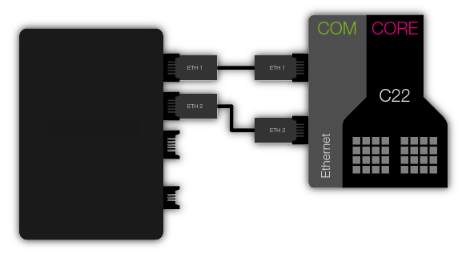

Ping demo
=====================================

The purpose of this app is showing the use of the module_ethernet_dual in your applications. For that, it implements a simple app that responses a ping to the IP address configured at the config file.

Overview
----------
We will ping the IP of our SOMANET node from a terminal. Then we will run the application on a SOMANET node connected to our Ethernet Local Area Network. At this point we should be receiving the ping responses from our SOMANET. 

Hardware setup
----------

To successfully test the application you will need:

* A SOMANET node composed (at least) by a CORE C22 and a COM Ethernet boards (IFM is not required).
* A COM Ethernet Cable STP RJ45 to PicoBlade 5pin (two cables will allow testing both ports simultaneously).
* A PC that shares a Local Area Network with your SOMANET node (this is achievable by simply connecting the node to your computer Ethernet interface)  

Quick how-to
------------

* First of all you should make sure that the IP addresses configured in your config/ethernet_config.h file are suitable and unused at your Local Area Network. 

* Then, open two terminals and ping the IPs that you will be using for each port. In this tutorial we use the IP addresses by default.
At one terminal ping the IP for port 1:

::

	ping 192.168.101.80 

At the other terminal ping the IP for port 2:

::

	ping 192.168.101.81 

* In both terminals, no response should be received:

::

	PING 192.168.101.8x (192.168.101.8x) 56(84) bytes of data.
	From 192.168.101.xx icmp_seq=1 Destination Host Unreachable
	From 192.168.101.xx icmp_seq=2 Destination Host Unreachable
	From 192.168.101.xx icmp_seq=3 Destination Host Unreachable
	From 192.168.101.xx icmp_seq=4 Destination Host Unreachable
	From 192.168.101.xx icmp_seq=5 Destination Host Unreachable
	...

* Run the app_dual_ethernet_ping application on your SOMANET. You should see your two ports' MAC Addresses at your console output and the initialization message.

::		

	MAC on P1: F0:CA:F0:CA:F0:CA
	MAC on P2: CA:FE:CA:FE:CA:FE
	Ethernet initialised on P1
	Ethernet initialised on P2

* At this point your terminal must show the SOMANET ping responses:

::

	64 bytes from 192.168.101.8x: icmp_req=x ttl=64 time=0.021 ms
	64 bytes from 192.168.101.8x: icmp_req=x ttl=64 time=0.047 ms
	64 bytes from 192.168.101.8x: icmp_req=x ttl=64 time=0.042 ms
	64 bytes from 192.168.101.8x: icmp_req=x ttl=64 time=0.049 ms
	64 bytes from 192.168.101.8x: icmp_req=x ttl=64 time=0.042 ms
	64 bytes from 192.168.101.8x: icmp_req=x ttl=64 time=0.049 ms

 

