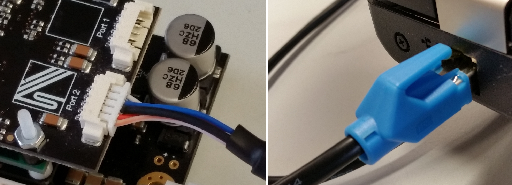

.. _SOMANET_Master_Firmware_Update_Demo_Quickstart:

SOMANET Master Firmware Update Demo Quick Start Guide
=====================================================

This is a standalone application for a Linux PC that enables SOMANET firmware deployment/update via Ethernet communication interface. The application is not intended to be modified by a user.

Hardware setup
++++++++++++++

**Important!** Please refer to the ``SOMANET nodes firmware update via Ethernet`` Quick Start instructions before continuing with this application. Make sure that you followed all steps there.

   Hardware Setup for SOMANET Firmware Update via Ethernet Demo
   
To setup up the system:

   #. Connect the SOMANET Option Ethernet cable to your node (any Ethernet port) and PC as shown in the image above.
   #. Make sure that the node is still powered and running the ``app_slave_fwupdate`` (SOMANET nodes firmware update via Ethernet) application. 

Run the application
+++++++++++++++++++

Now the next step is to run the application on your Linux PC to perform the SOMANET firmware update.

   1. Make sure that you have installed the latest Python 2.7 interpreter. Under Linux just do the following. ::

      sudo apt-get install python2.7

   2. Navigate to the ``app_master_fw_update`` folder using a terminal. Identify the ``app_master_fw_update.sh`` application there.
   3. To run the application you need root rights.
   4. To update the firmware on the SOMANET slave device, type one of the following commands: ::

       ./app_master_fw_update.sh -all /path/to/your/bin_file eth0
       ./app_master_fw_update.sh -n 1 -u /path/to/your/bin_file eth0

    The general usage of the command line is the following: ::

      Usage: flash_master.py [-h] [-scan] [-n NODE | -s SEQ | -a] [-u FILEPATH] [-v]
                             interface

      Positional arguments:
        interface             Network interface

      Optional arguments:
        -h, --help            show this help message and exit
        -scan                 Scan the slave/slaves connected and display their
                              serial number

      Required arguments:
        -n NODE, --node NODE            Node number
        -s SEQ, --sequence SEQ          Specify slave number 1..n
        -a, --all                       Use all slaves connected to the system
        -u FILEPATH, --update FILEPATH  Firmware upgrade option, followed by the image path
        -v, --version                   Gets the firmware version of the specified node.

   5. If the firmware updated correctly you will see the flashing completed message in the terminal line. 
   6. After each flashing/firmware updating process the nodes have to be power cycled to start the new firmware.

   .. _Python Download: https://www.python.org/downloads

