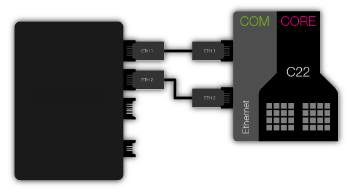
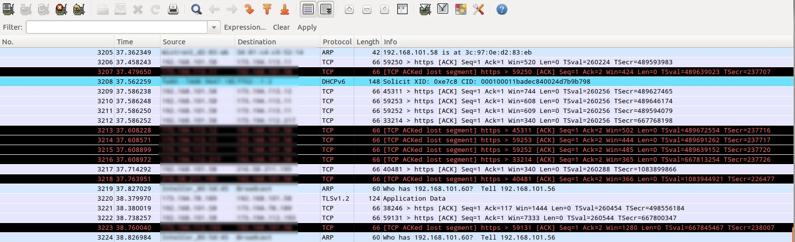
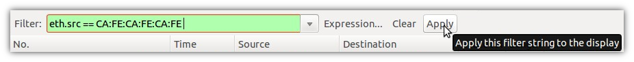
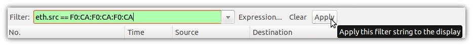

Loopback demo
=====================================

The purpose of this app is showing the use of the module_ethernet_dual in your applications. For that, it implements a dummy packet loopback over the two ports that the SOMANET COM Ethernet board offers.

Overview
----------
We will run the application on a SOMANET node connected to our Ethernet Local Area Network. At this point the node will start sending back all the packets that it receives but changing the sender MAC address. Then we will sniff the existing packets forwarded over the network. At this sniffed traffic we will see all the packets sent by the SOMANET. 

Hardware setup
----------

To successfully test the application you will need:

* A SOMANET node composed (at least) by a CORE C22 and a COM Ethernet boards (IFM is not required).
* A COM Ethernet Cable STP RJ45 to PicoBlade 5pin (two cables will allow testing both ports simultaneously).
* A PC that shares a Local Area Network with your SOMANET node (this is achievable by simply connecting the node to your computer Ethernet interface)  

Quick how-to
------------

* Download and install in your computer WireShark_. This program monitors the traffic of Ethernet packets in your network.
* Open WireShark and start a live capture on the interface connected to your LAN. You will see all the traffic going on...

* Then we will apply a filter over all the sniffed packets, where just are shown those packets whose sender is our SOMANET node:

Packets sent over port 1:	
::
	
		eth.src == CA:FE:CA:FE:CA:FE 

Packets sent over port 2:	
::

		eth.src == F0:CA:F0:CA:F0:CA	

* Run the app_dual_ethernet_loopback application on your SOMANET. You should see your two ports' MAC Addresses at your console output.

::		

	MAC on P1: F0:CA:F0:CA:F0:CA
	MAC on P2: CA:FE:CA:FE:CA:FE

``note that these addresses can be changed at the file config/ethernet_config.h``

* If you connect now your SOMANET to the network you will start seeing packets on WireShark.

.. figure:: images/wireshark4.png
   :width: 100%

.. _WireShark: http://www.wireshark.org
