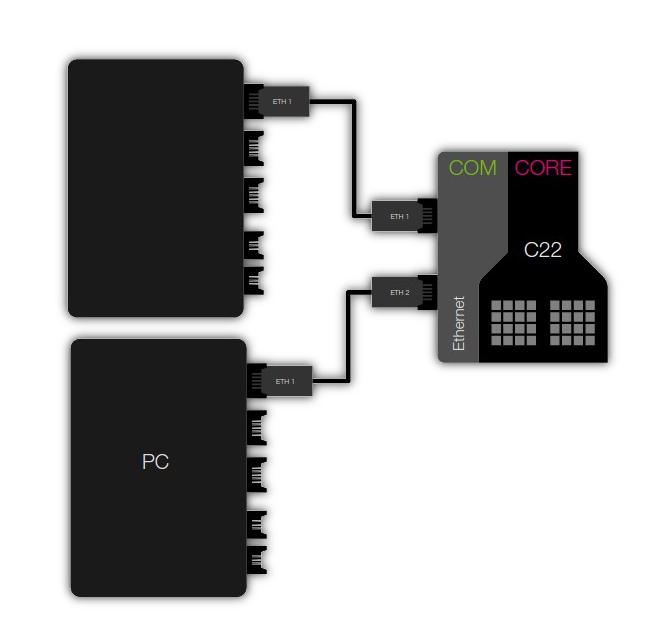

Ethernet Hub demo
==================

.. contents:: In this document
    :backlinks: none
    :depth: 2

The purpose of this app is showing the use of the :ref:`SOMANET Ethernet Hub Module <module_ethernet_hub>` in your applications. For that, it implements a simple Ethernet hub. An application layer also filters the received packets and takes all broadcasted ARP packets.

As you will understand, there is not a specific single way to use a hub. Nevertheless, in this tutorial we will set the hub in between our PC and the internet.

Hardware setup
--------------

To successfully test the application you will need:

* A :ref:`SOMANET node <getting_started_somanet_hardware>` composed (at least) by a :ref:`SOMANET CORE C22 <core_c22>` and a :ref:`SOMANET COM Ethernet <com_ethernet>` boards (IFM is not required).

* Two COM Ethernet Cable STP RJ45 to PicoBlade 5pin.

* A PC connected to the internet.  

Quick how-to
------------

* Connect the Ethernet interface of your computer to the port 1 of your SOMANET. Then connect port 2 to your internet access point. 

* Run the **app_ethernet_hub** application on your SOMANET. From this moment, you should have internet acccess in your computer.

 
