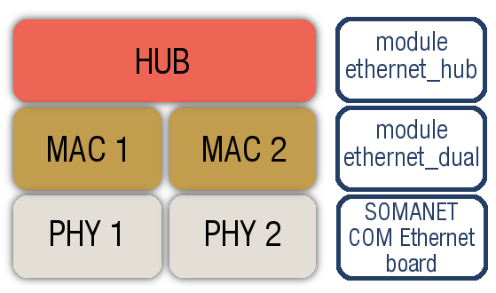

SOMANET Ethernet Library
========================

The **SOMANET Ethernet Library** provides Ethernet support for SOMANET devices. 

Hardware Compatibility
-----------------------

.. cssclass:: float-left

+---------------------------+
| Required SOMANET Hardware |
+===========================+
| 1x SOMANET **Core**       |
+---------------------------+
| 1x SOMANET **COM**        |
+---------------------------+

.. cssclass:: float-left

+----------------------------------------------+
| Supported SOMANET Devices                    |
+==============================================+
| SOMANET Core: :ref:`C22 <core_c22>`          |
+----------------------------------------------+
| SOMANET COM: :ref:`Ethernet <com_ethernet>`  |
+----------------------------------------------+

Modules
--------

.. toctree::
	:maxdepth: 1
	:hidden:

	Ethernet MAC (dual-port) Module <module_ethernet_dual/doc/index>
	Ethernet Hub module <module_ethernet_hub/doc/index>

	
Our SOMANET Ethernet Library is composed of the following modules:

* `Ethernet MAC (dual-port) Module <module_ethernet_dual/doc/index.html>`_: This module allows an abstract access for the application or other upper layers to two different and parallel-running Ethernet MAC layers.
* `Ethernet Hub Module <module_ethernet_hub/doc/index.html>`_: This module offers a layer that runs on top of the Ethernet dual Stack. It connects together two Ethernet interfaces and makes them act as a single network segment. It also provides the received data packets to the upper layers.
* Ethernet SMI Module: This module allows code to communicate with ethernet phys that are configured using the SMI serial protocol.

Examples
--------

.. toctree::
	:hidden:
	:maxdepth: 1

	Ping demo <examples/app_dual_ethernet_ping/doc/index>
	Loopback demo <examples/app_dual_ethernet_loopback/doc/index>
	Ethernet hub demo <examples/app_ethernet_hub/doc/index>

Additionally, the library includes the following examples:

* `Ping demo <examples/app_dual_ethernet_ping/doc/index.html>`_: Learn how to use Ethernet MAC (dual-port) Module in your applications implementing a simple app that responses a ping to the IP address configured at the config file.
* `Loopback demo <examples/app_dual_ethernet_loopback/doc/index.html>`_: Learn how to use Ethernet MAC (dual-port) Module in your applications implementing a dummy packet loopback over the two ports that the SOMANET COM Ethernet board offers.
* `Ethernet hub demo <examples/app_ethernet_hub/doc/index.html>`_: Learn how to use Ethernet Hub Module in your applications implementing a simple Ethernet hub.

Dependencies
------------

To run your **application** it is necessary to include :ref:`SOMANET Base <somanet_base>`.

.. note:: **SOMANET COM Ethernet** hardware modules are required to be used with this software.
	
	Visit our :ref:`SOMANET COM Ethernet <com_ethernet>` documentation for further information.

