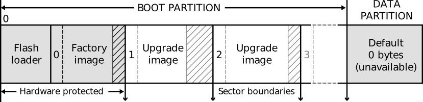

.. _enet_overview_label:

Module Ethernet Firmware Update
===============

XMOS provides the possibility to upgrade the firmware in a save way. The normale firmware consist of the firmware and the boot/flash loader (called Factory Image).
When the microcontroller is booting, the flash loader searched in the flash memory for bootable images. The flash loader loads automatically the image
with the highest version number with a valid CRC.

Flash format
--------------

The factory image is that image, that will be build in your xTIMEcomposer, when you hit the Flash-Button. It is not recommended, to delete this image. Although the diagramm
says, it is hardware protected, it is possible. 
The advantage is, when your upgrade is failing, the flash loader will load automatically the factory image and you can try again, to add a new image.

For further information take a look in the PDF `Design and manufacture systems with flash memory`_ by XMOS.

Build an upgrade image
---------------

To build an upgrade image, use xflash with following commands:
::
	xflash --factory-version XTIMECOMPOSER-VERSION --upgrade VERSION XE-FILE [SIZE] -o UPGRADE-IMAGE-NAME

For further information take a look in the PDF `XFLASH Command-Line Manual`_ by XMOS.	

	
Options
--------------

* XTIMECOMPOSER-VERSION: Your xTIMEcomposer version
* VERSION: Version number of your upgrade image. Must be higher then 0
* XE-FILE: Your app build.
* SIZE: Image size. Adds trailing zeros. In our case size should be multiple of flash page size.
* UPGRADE-IMAGE-NAME: Upgrade image name. 

E.g:
::
	xflash --factory-version 13.2 --upgrade 1 app.xe 65536 -o upgrade_image
	
	
.. _Design and manufacture systems with flash memory: https://download.xmos.com/XM-000949-PC-9.pdf?auth=WzAsIjkxLjE4Ljg1LjExIiwxNDUwMzQxMzA5LCJYTS0wMDA5NDktUEMtOS5wZGYiXQ==
.. _XFLASH Command-Line Manual: https://download.xmos.com/XM-000965-PC-8.pdf?auth=WzAsIjc5LjE5Ny4yMjUuMTYyIiwxNDUwMjk2NTk4LCJYTS0wMDA5NjUtUEMtOC5wZGYiXQ==
